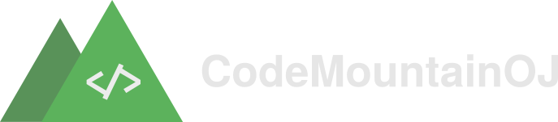

  

---

The free and opensource online judge for everyone

---

## Why?

We are creating this online judge to learn more about technologies. Also to provide a better experience to the user for free and provide the ability to customize to the end user. This online judge will be created with performance and reliability on mind.

## Technologies

### Languages

### Frameworks/Libraries

### Database

## Installation/Set up

See Installation.md

## Contribution

Contribute to this project by contributing codes, graphics, etc.
Just make a fork and do your changes and then make a PR. If it's good enough, we'll merge it.

## Community

Join our Discord server, where the devs will be active. You can make suggestions for features, report issues there.

[Link to the invitation](https://discord.gg/F9PAKfA5rC)
